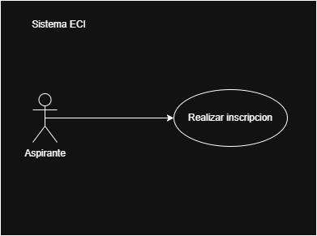

## Ejercicio 2: Análisis de Requerimientos - Formulario de Inscripción

**Nombre:** Formulario de inscripción a la carrera 
**Descripción:** El sistema debe permitir a un aspirante diligenciar y enviar sus datos personales y académicos para solicitar la admisión a un programa de pregrado de la Escuela Colombiana de Ingeniería Julio Garavito.
**Cómo se ejecutará:** A través de la página web principal de la institución, accesible desde cualquier navegador estánda.
**Actor Principal:** Aspirante.
**Precondiciones:** El usuario debe contar con conexión a internet y el periodo de admisiones debe estar habilitado en el sistem.

**Datos de entrada y de salida:** 
* **Entrada:** Nombres, apellidos, tipo y número de documento de identidad, correo electrónico, colegio de procedencia, y programa académico a cursar.
* **Salida:** Número de radicado de la solicitud y correo electrónico de confirmación de registro exitoso.

**Flujo Básico:**
1. El aspirante ingresa a la sección de admisiones en el portal web de la Escuela.
2. El sistema presenta el formulario de inscripción vacío.
3. El aspirante diligencia todos los campos requeridos.
4. El aspirante hace clic en el botón "Validar" e inscribe la solicitud.
5. El sistema valida la correctitud de los formatos de los datos.
6. El sistema almacena la información en la base de datos de admisiones.
7. El sistema muestra una pantalla de éxito con el número de radicado.

**Flujo Alterno:** 
**Datos incompletos o inválidos:* Si el aspirante omite un campo obligatorio o ingresa un formato incorrecto, el sistema detiene el envío y resalta visualmente los campos afectados con un mensaje de ayuda claro, expresado en un lenguaje entendible y sin códigos de error.
* *Aspirante ya registrado:* Si el documento de identidad ya se encuentra registrado para el periodo actual, el sistema muestra el mensaje: "Ya existe una solicitud en proceso asociada a este documento".

**Reglas de negocio:**
* El botón de "Validar" del formulario de inscripción debe ser de color morado.
* El requerimiento debe tener una sola interpretación.

**Diagrama de Casos de Uso:**
