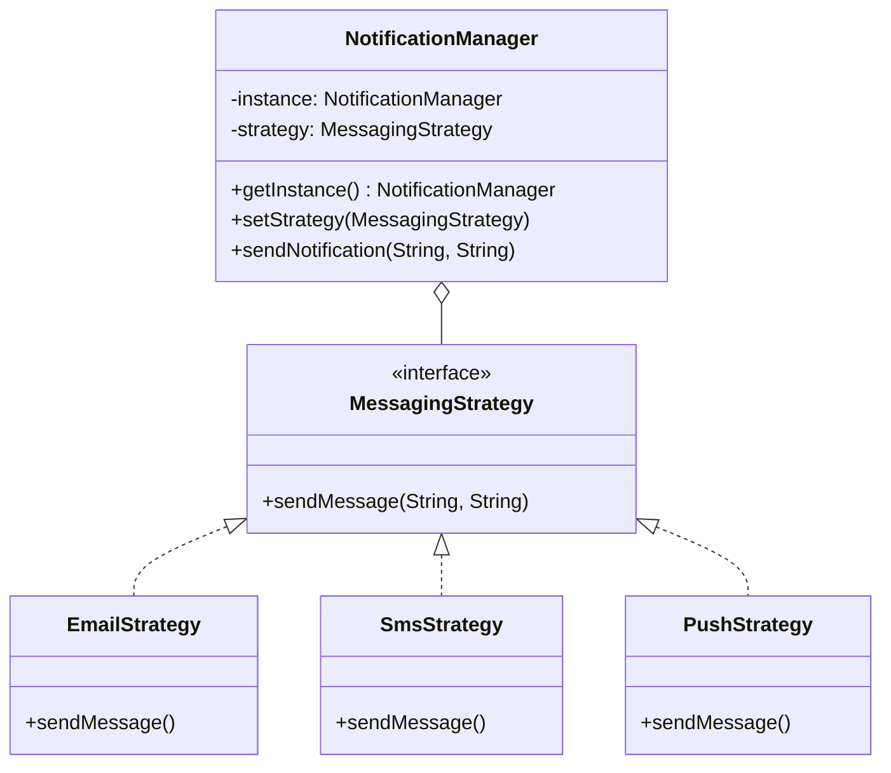

# Bitácora de Aprendizaje - Corte 2 - Semana 2

## Ejercicio 1: Sistema de Notificaciones

### Patrones Utilizados
1. **Singleton** (Creacional):
   - **Justificación**: Se requiere un servicio centralizado (`NotificationManager`) que gestione los envíos de manera única en todo el sistema, evitando redundancia de instancias.
2. **Strategy** (Comportamiento):
   - **Justificación**: Permite cambiar dinámicamente el algoritmo de envío según el canal (Email, SMS, Push) sin modificar el cliente.
3. **Simple Factory** (Creacional):
   - **Justificación**: Simplifica la creación de las estrategias desacoplando la lógica de instanciación del cliente.

### Diagrama de Clases (Lógica)

---

## Ejercicio 2: Sistema de Procesamiento de Pagos

### Patrones Utilizados
1. **Adapter** (Estructural):
   - **Justificación**: Unifica las interfaces heterogéneas de proveedores externos (PayPal, Stripe) a una interfaz interna estándar `PaymentProcessor`.
2. **Chain of Responsibility** (Comportamiento):
   - **Justificación**: Implementa una cadena de validaciones (Saldo, Fraude, Límite) donde cada eslabón decide si el proceso continúa, facilitando la adición/eliminación de validaciones.

---

## Ejercicio 3: Sistema de Reportes

### Patrones Utilizados
1. **Builder** (Creacional):
   - **Justificación**: Permite la construcción paso a paso de reportes complejos (PDF, JSON, CSV), controlando la secuencia de creación de secciones.
2. **Decorator** (Estructural):
   - **Justificación**: Añade funcionalidades adicionales (Firma, Marca de agua) a los reportes de forma dinámica y sin alterar el código original de las clases de reporte.

---

## Gestión del Tiempo
| Actividad | Tiempo Estimado | Tiempo Real |
| :--- | :--- | :--- |
| Planificación y UML | 1 hora | 45 min |
| Implementación E1 (Notificaciones) | 1 hora | 1 hora |
| Implementación E2 (Pagos) | 1.5 horas | 1 hora 20 min |
| Implementación E3 (Reportes) | 1.5 horas | 1 hora |
| Pruebas y Calidad | 1 hora | 40 min |

**Reflexión**: La aplicación de patrones estructurales como Adapter y Decorator ha permitido que el código sea altamente extensible, cumpliendo con el principio Open/Closed.

## Evidencias
- **Pruebas**: 21 tests ejecutados exitosamente (`mvn test`).
- **Análisis**: Cobertura JaCoCo superior al 80% en los módulos críticos.
